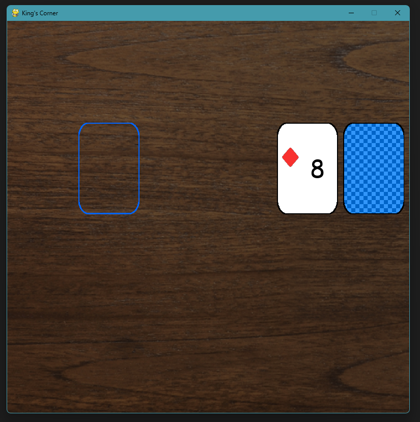
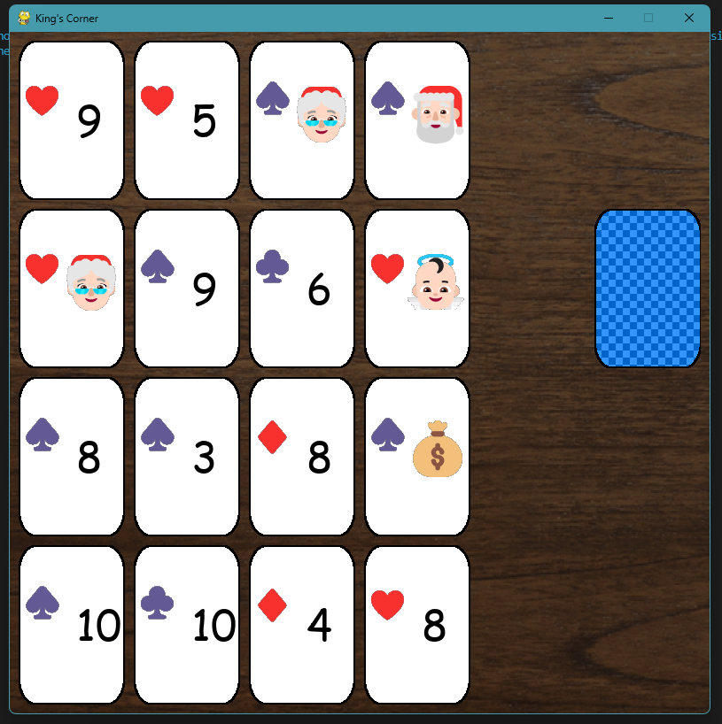

# King's corner
A fun single-player card game made in python, with pygame

If you don't already have pygame installed you can install by running `pip install pygame` in the terminal.

You start with your deck of standard playing cards on the right of the board.

The face-up card to the left of the deck is a card you need to put down on the 4x4 grid on the left.

(hover your mouse over the left of the board and the blue outline is where you can place your cards.)

Click on one of the spaces marked by the blue outline to set your card there. More card will continue appearing to the left of the deck until you filled the whole area.

The cards with Santa 🎅🏻 on them are the kings, Mrs. Clause 🤶🏻 is the queen, the angel-baby-thing 👼🏻 is the jack, and the money bags 💰 are aces.

Kings can only be placed in the corners, and queens and jacks must be placed on the sides.

If you can't place a king in one of the corners, (because they are full), then you lose. The same thing happens for queens and jacks.

Once you filled the whole are with cards,

you will begin removing the cards. Click on two cards that add up to ten (or just one ten) (and aces are ones) to remove them.

Once you are done removing cards, press the d key to flip up the top card of the deck and repeat the process of placing the cards down.

You win when you survive until the deck runs out, and you lose when you have a king, queen, or jack that you can't place.
